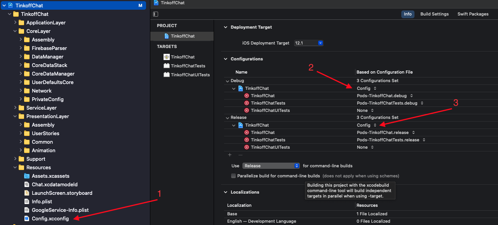
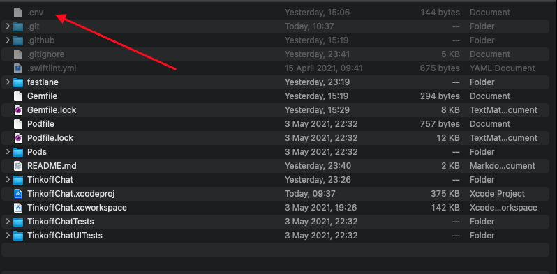

# TinkoffChat


## Общее описание 

Проект для Финтех школы Тинькофф iOS Developer, весна 2021

## Особенности репозитория
* Переменная DISCORD_WEBHOOK_URL задана в Actions secrets

## Запуск проекта на локальной машине
* Добавить [файл конфиг](https://drive.google.com/file/d/1OAbnphA51vY6C9TimN6KwK-kdpkPgSmB/view?usp=sharing "файл конфиг") в корень проекта



## Настройка Fastlane на локальной машине
### Проверка кода линтером:
* Выполняется лайном **swiftlint_run**, вызываемый командой:
```
bundle exec fastlane swiftlint_run
```
* Для этого необходимо установить пакет:
```
brew install swiftlint
``` 

### Получения уведомления в Discord:
* Выполняется лайном **send_discord_notification**, вызываемый командой:
```
bundle exec fastlane send_discord_notification
```
Для этого необходимо:
1. Установить пакет:
```
brew install libsodium
```
2. Добавить [.env файл](https://drive.google.com/file/d/14wq__6np-U8wHIFRoAT5BgkGNLZfDqpb/view?usp=sharing ".env файл")  в корень проекта 


